```{r setup, include=FALSE}
knitr::opts_chunk$set(echo = FALSE, warning=FALSE, message=FALSE)
```

```{r libraries and data}
# load libraries ----------------------------------------------------------
library("gridExtra")                        # Load gridExtra package
library(janitor)
library(patchwork)
library(tidyverse)
library(readxl)
library(lubridate)
library(patchwork)
# library(DataCombine)
library(tidymodels)
library(patchwork)
# library(rstanarm)
library(kableExtra)
theme_set(theme_bw(16)) #set theme to save typing
```

```{r custom plot function}
tp_plot <- function(df, x, y) {
  ggplot(df, aes(x={{x}}, y={{y}})) +
    geom_point(alpha = 0.6,
               col = 'midnightblue',
               size = 2) +
    geom_abline(col = 'grey50', 
                lty = 3, 
                lwd = 1.2) +
    tune::coord_obs_pred() +
    geom_smooth(method = "lm", se=F)+
    theme_bw(16, "serif")
}

```


```{r ECA feature information data import}
# Composition ------------------------------------------------------------

eca_comp <-
  read_excel("MasterDB-SQL-2021-07-28 NS.xlsx",
             sheet = "Composition") %>%
   janitor::clean_names() %>%
  filter(skip==FALSE,
         tool== "AA/LECO (C&S)-Filings") %>%
     mutate(across(.cols = c:ca, ~ ifelse(str_detect(string = .x, pattern = "<"),
        as.numeric(str_remove(string =.x, pattern =  "<"))/ 4,
    as.numeric(.x)))) %>% 
  filter(
   ni < .5 | is.na(ni),
    cu < 1 | is.na(cu),
    ti < 1 | is.na(ti),
    cr < .3 | is.na(cr),
    al < 1 | is.na(al),
    c < 0.4 | c > 0.03 | is.na(c),
    si < 0.35 | is.na(si),
    mn < 3| is.na(mn),
    mo < 0.1 | is.na(mo)
  ) %>%
  mutate(
    c = ifelse(c > 0.4 | c < .03, NA, c),
    mn = ifelse(mn > 2 | mn < .2, NA, mn),
    p = ifelse(p > 0.16 | p < 0.001, NA, p),
    s = ifelse(s > 0.08 | s < 0.001, NA, s),
    si = ifelse(si > 0.5 | si < 0.005, NA, si),
    nb = ifelse(nb > 0.15 | nb < 0.0001, NA, nb),
    v = ifelse(v > 0.15 | v < 0.0001, NA, v),
    ti = ifelse(ti > 0.15 | ti < 0.0001, NA, ti),
    ni = ifelse(ni > 0.3 | ni < 0.0001, NA, ni),
    cu = ifelse(cu > 0.5 | cu < 0.0001, NA, cu),
    mo = ifelse(mo > 0.15 | mo < 0.0001, NA, mo),
    cr = ifelse(cr > 0.3 | cr < 0.0001, NA, cr),
    b = ifelse(b > 0.001 | b < 0.00001, NA, b),
    ca = ifelse(ca > 0.01 | ca < 0.00001, NA, ca)
  )  %>% 
  group_by(group, feature) %>%
  summarise(across(
    .cols = c:ca,
    .fns = mean,
    na.rm = T
  )) %>%
  select(group,
         feature,
         al,
        c,
        cr,
        cu,
        mn,
        mo,
        nb,
        ni,
        p,
        s,
        si,
        v)

# Feature data -----------------------------------------------------------

eca_feature <-
  read_excel("MasterDB-SQL-2021-07-28 NS.xlsx",
             sheet = "Features") %>%
  janitor::clean_names() %>%
  # select(
  #   group,
  #   feature_id,
  #   feature_type,
  #   grade,
  #   od_inch,
  #   seam_type,
  #   recorded_nominal_wt_inch,
  #   pg_e_install_year,
  #   mfr_year
  # ) %>%
  rename(
    OD = od_inch,
    wall = recorded_nominal_wt_inch,
    feature = feature_id,
    year = pg_e_install_year
  ) %>%
  mutate(
    mfr_year = (str_sub(mfr_year, 1, end = 4)),
    mfr_year = ifelse(mfr_year == "earl", 1952, mfr_year),
    group = ifelse(group == "ARB Houston", "ATS-ARBH", group),
    grade = case_when(
      group == "Modesto Yard" & feature == "Feature 6" ~ "NA",
      group == "Modesto Yard" & feature == "Feature 8" ~ "NA",
      group == "Modesto Yard" & feature == "Feature 15" ~ "NA",
      group == "Modesto Yard" & feature == "Feature 16" ~ "NA",
      group == "Modesto Yard" & feature == "Feature 17" ~ "NA",
      group == "Modesto Yard" & feature == "Feature 18" ~ "NA",
      group == "Modesto Yard" & feature == "Feature 19" ~ "NA",
      TRUE ~ grade
    ),
    year = case_when(
      str_detect(string = year, pattern = "/") ~ str_sub(year,-4),
      group == "Modesto Yard" & feature == "Feature 6" ~ "NA",
      group == "Modesto Yard" & feature == "Feature 8" ~ "NA",
      group == "Modesto Yard" & feature == "Feature 15" ~ "NA",
      group == "Modesto Yard" & feature == "Feature 16" ~ "NA",
      group == "Modesto Yard" & feature == "Feature 17" ~ "NA",
      group == "Modesto Yard" & feature == "Feature 18" ~ "NA",
      group == "Modesto Yard" & feature == "Feature 19" ~ "NA",
      is.na(year) ~ mfr_year,
      TRUE ~ year
    ),
    year = as.numeric(year),
    OD = as.numeric(OD),
    wall = as.numeric(wall),
    grade = case_when(
      str_detect(grade, "35000") ~ "Grade B",
      str_detect(grade, "B") ~ "Grade B",
      str_detect(grade, "X42") ~ "X42",
      str_detect(grade, "A-53") ~ "Grade B",
      grade == "30000" ~ "Early",
      grade == "40000" ~ "X42",
      grade == "X-60" ~ "X60",
      grade == "X-48" ~ "X46",
      str_detect(grade, "48") ~ "X46",
      str_detect(grade, "65") ~ "X65",
      grade == "GR B" ~ "Grade B",
      grade == "Unknown" ~ "NA",
      grade == "N/A" ~ "NA",
      grade == "B/Unknown" ~ "Grade B",
      TRUE ~ grade
    ),
    grade = str_remove(grade, "API 5L "),
    grade = str_remove(grade, "-"),
    grade = ifelse(grade == "NA", NA, grade),
    source = "ECA2"
  ) %>%
  filter(feature_type == "Pipe")

# IIT data ----------------------------------------------------------------

eca_ndt <-
 read_excel("MasterDB-SQL-2021-07-28 NS.xlsx",
             sheet = "NDT") %>%
  janitor::clean_names() %>%
  rename(group = group_name) %>%
  filter(
    skip == FALSE,
    group != "Calibration Blocks",
    str_detect(
      "Old",
      negate = T,
      vendor_test_area_label),
      reader_method == "DPT",
      vendor %in% c('ATS', 'TDW')
    ) %>%
      group_by(group, feature) %>%
      summarise(
        iitys_5 = mean(x0_5_percent_eul_ys_ksi, na.rm = T),
        iituts = mean(uts_ksi, na.rm = T),
        nsamples = n()
      ) 
# %>%
#       filter(nsamples >= 10
#       )


# Tensile data ------------------------------------------------------------

eca_tensile <-
read_excel("MasterDB-SQL-2021-07-28 NS.xlsx",
             sheet = "Tensile") %>%
  janitor::clean_names() %>%
  filter(skip == FALSE ,
         type != "Weld" ,
         type != "GirthWeldStrip" ,
         group != "Calibration Blocks") %>%
  rename(ys5 = x0_5_percent_eul_ys_ksi,
         uts = uts_ksi,
         ten_n = n
         ) %>%
  group_by(group, feature) %>%
  summarise(ten_ys = mean(ys5, na.rm = T),
            ten_uts = mean(uts, na.rm = T),
            ten_n = mean(ten_n, na.rm = T))

# Wall Thickness -----------------------------------------------------

eca_wt <- read_excel("MasterDB-SQL-2021-07-28 NS.xlsx",
                     sheet = "Wall Thickness")  %>%
  clean_names() %>%
  filter(str_detect(location_type, "AFG", negate = T)) %>%  
  group_by(group, feature) %>%
  summarize(wt_in = mean(measurement_in, na.rm = T))  #%>%
  # select(group,
  #        feature,
  #          wt_in)
#remove any wall thickness measurements after grind (AFG)

## Charpy data ----------------------------------------------------------       

eca_cvn <- read_excel("MasterDB-SQL-2021-07-28 NS.xlsx",
                         sheet = "Charpy")  %>%
  clean_names() %>% 
  full_join(eca_wt, by= c("group", "feature")) %>% 
  filter(str_detect(location, "Base")) %>% #removing weld tests
  mutate(
    SA_SS = ifelse(shear_area_percent==100, 0.99,shear_area_percent/ 100),
    #calc subsize shear area with 0.99 to avoid singularities and rename
    t_ss_mm = charpy_size_mm,
    #rename subsize charpy thickness in mm
    t_ss_in = t_ss_mm / 25.4,
    #calc subsize charpy thickness in inches
    sigA = (-29.3943) * (t_ss_mm / 10) ^ 2 + 72.9619 * (t_ss_mm / 10) +
      6.2530,
    #calc sigmoidal parameter A per API 579 table on page 9F-3
    sigB = (76.0070) * (t_ss_mm / 10) ^ 3 + 
      (-183.4809) * (t_ss_mm / 10) ^ 2 +
      148.2843 * (t_ss_mm / 10) - 7.8121,
    #calc sigmoidal parameter B per API 579 table on page 9F-3
    TT_SS_F =  temperature_f - sigB * log(SA_SS / (1 - SA_SS)) + sigA,
    #calc subsize transition temp
    #previously a 0.99 was added at the end to correct
    TT_FS_F = TT_SS_F + 66 * (wt_in ^ 0.55) * (t_ss_in ^ (-.7) - 0.394 ^ (-.7)),
    #calc fullsize (0.394 in size) transition temp using the nominal wall thickness
    CVN_SS = absorbed_energy_ft_lbs,
    #rename subsize CVN
    CVN_US_SS = CVN_SS / (0.9 * SA_SS + 0.1),
    #calc subsize CVN upper shelf energy from subsize CVN and subsize shear area
    CVN_US_FS = CVN_US_SS * 0.394 / t_ss_in
    #calc fullsize CVN upper shelf energy
  ) %>%
  group_by(group, feature) %>%
  summarize(
    CVN_US_FS = mean(CVN_US_FS, na.rm = T),
    TT_FS_F = mean(TT_FS_F, na.rm = T)
  ) %>%
  select("group", "feature", "CVN_US_FS", "TT_FS_F")
#-------------------------------------------------------------------------

fimp_micro <-
  read_excel("Microstructure_Data_Collection_Online_2021_01_05_S5CJ.xlsx",
             sheet = "Collection2") %>%
  rename(
    polygonal = `Polygonal ferrite grains that are relatively distinct and free of dots, lines or cloudy features.`) %>%
  clean_names() %>% 
  mutate(
    sample_type = str_replace(sample_type, "-", "_"),
    group_feature = paste0(group, " ", feature),
    year = year(evaluation_date),
    path = str_remove(string = path, pattern = ".jpg"),
    path = str_remove(string = path, pattern = ".tif")
  ) %>%
  filter(sample_type == "Replica") %>% 
  group_by(group, 
           feature,
           sample_type
           ) %>%
  summarise(
    astm_grain_size = mean(astm_grain_size, na.rm = T),
    mean_linear_intercept = mean(mean_linear_intercept, na.rm = T),
    pct_dark_phase = mean(pct_dark_phase, na.rm = T),
    ) %>%
  ungroup()

## Join the data -----------------------------------------------------
ndt_ten_comp <- eca_ndt %>%
  full_join(eca_feature,
            by = c("group", "feature")) %>%
  full_join(eca_comp,
            by = c("group", "feature")) %>%
  full_join(eca_tensile,
            by = c("group", "feature")) %>%
  full_join(eca_cvn, 
            by = c("group", "feature")) %>% 
  full_join(fimp_micro, 
            by = c("group", "feature")) %>% 
  ungroup() %>% 
  distinct() %>% 
  mutate(dt = OD/wall)

ndt_ten_comp_micro <- as.data.frame(ndt_ten_comp[complete.cases(ndt_ten_comp[ , "astm_grain_size"]),]) 

```

```{r microstructural station data import}

station_micro <- read_excel("Microstructure_Evaluation_Worksheet_2020_08_20_Rabbit_Springs.xlsm",
                      sheet = "4)Values") %>%
  janitor::clean_names() %>%
  mutate(
    sample_type = str_replace(sample_type, "-", "_"),
    group_feature = paste0(group, " ", feature),
    year = year(date_of_evaluation),
    path = str_remove(string = path, pattern = ".jpg"),
    path = str_remove(string = path, pattern = ".tif"),
    pct_dark_phase = percent_dark_phase
  ) %>%
  select(
    group,
    feature,
    alternate_id,
    polygonal_or_irregular,
    method,
    pct_dark_phase,
    astm_grain_size,
    mean_linear_intercept
  ) %>% 
  group_by(group, feature, alternate_id) %>% 
  summarize(pct_dark_phase = round(mean(pct_dark_phase, na.rm = TRUE),1),
            astm_grain_size = round(mean(astm_grain_size, na.rm = TRUE),1),
            mean_linear_intercept = round(mean(mean_linear_intercept, na.rm = TRUE),1)) %>% 
  ungroup() %>% 
  mutate(
    gs_min = astm_grain_size - 1,
    gs_max = astm_grain_size + 1,
    dp_min = pct_dark_phase - pct_dark_phase * .2,
    dp_max = pct_dark_phase + pct_dark_phase * .2
    # ,
    # yearstart = min(ndt_ten_comp_micro$year, na.rm = TRUE),
    # yearend = max(ndt_ten_comp_micro$year, na.rm = TRUE)
  )
```


```{r station feature table prep}

## Join the station data -----------------------------------------------------
station_feature_wt_ndt <- eca_feature %>%
  full_join(eca_wt, by = c("group", "feature")) %>% 
  full_join(eca_ndt, by = c("group", "feature")) %>% 
  filter(group == "Rabbit Springs",
        feature %in% c("JT-51", "JT-62.5", "JT-74.5", "JT-77.4", "JT-127", "JT-138.5")) %>% 
  mutate(
    "feature type" = feature_type,
    "seam type" = seam_type,
    "OD (in)" = OD,
    "WT (in)" = round(wt_in, 3),
    "IIT YS (ksi)" = round(iitys_5, 1),
    "IIT UTS (ksi)" = round(iituts, 1)
    ) %>% 
  select(
    feature,
    "feature type",
    "seam type",
    year,
    "OD (in)",
    "WT (in)",
    "IIT YS (ksi)", 
    "IIT UTS (ksi)"
  )
```


# Updates needed:

plot of year vs silicon and sulfur in appendix with the Rabbit Springs data overlaid

comparison of carbon content with dark phase for a consistency check. Show the calculated expected equilibrium pct Pearlite phase based on the carbon content and then show the measured dark phase

compare Mn content with grain size for a consistency check

Ask Joel to make sure there is nothing in the microstructure report that disagrees with the grade result.

# Feature Information   

RSI-Pipeline Solutions was requested by Pacific Gas and Electric's (PG&E) Facilities Integrity Management Program (FIMP) to analyze microstructures from a facility known as Rabbit Springs.

The features of interest along with relevant information are listed in the following table. 
```{r station feature table}
knitr::kable(station_feature_wt_ndt)
```

```{r station feature table 2}
knitr::kable(station_feature_wt_ndt, align = c(rep('c', times=8)), col.names = c("Feature", "Type", "Seam Type", "Install Year", "OD", "WT", "IIT Yield Strength (ksi)", "IIT Tensile Strength (ksi)" ))  %>% remove_column(1)

# kable(datatable,align=c(rep('c',times=7)),
# col.names = c("Copy","Sigma Est","Sigma Lower","Sigma Upper", 
# "Lambda Est","Lambda Lower","Lambda Upper"),digits=3)

```

The compositional elements, carbon (C), manganese (Mn), sulfur (S), and silicon (Si) are important in steelmaking and are also generally reliable elements for identification of possible groups of pipe, when estimated using filings removed from the pipe surface. The following table provides the filings analysis for C, Mn, S, and Si. For this station, features JT-51, JT-62.5, JT-127, and JT-138.5 had essentially similar compositions, but features JT-74.5 and JT-77.4 differed significantly in terms of Si, Mn, and S content.

```{r station comp}

## Join the station data -----------------------------------------------------
station_comp <- eca_feature %>%
  full_join(eca_comp, by = c("group", "feature")) %>%
  full_join(eca_wt, by = c("group", "feature")) %>% 
  full_join(eca_ndt, by = c("group", "feature")) %>% 
  filter(group == "Rabbit Springs",
        feature %in% c("JT-51", "JT-62.5", "JT-74.5", "JT-77.4", "JT-127", "JT-138.5")) %>% 
  mutate(
    "C (wt%, filings)" = format(round(c, 2), nsmall = 2),
    "Mn (wt%, filings)" = format(round(mn, 2), nsmall = 2),
    "S (wt%, filings)" = format(round(s, 3), nsmall = 3),
    "Si (wt%, filings)" = format(round(si, 2), nsmall =2)
    ) %>% 
  select(
    group,
    feature,
    "C (wt%, filings)",
    "Mn (wt%, filings)",
    "S (wt%, filings)",
    "Si (wt%, filings)"
  )

knitr::kable(station_comp) %>% remove_column(1)


```


# Images 

The microstructures that were analyzed are shown below. For the in-situ images, the circular viewing area was determined to be 465 μm in diameter. This scale is based on images taken by the vendor of a calibrated reference slide and is important for grain size estimation.

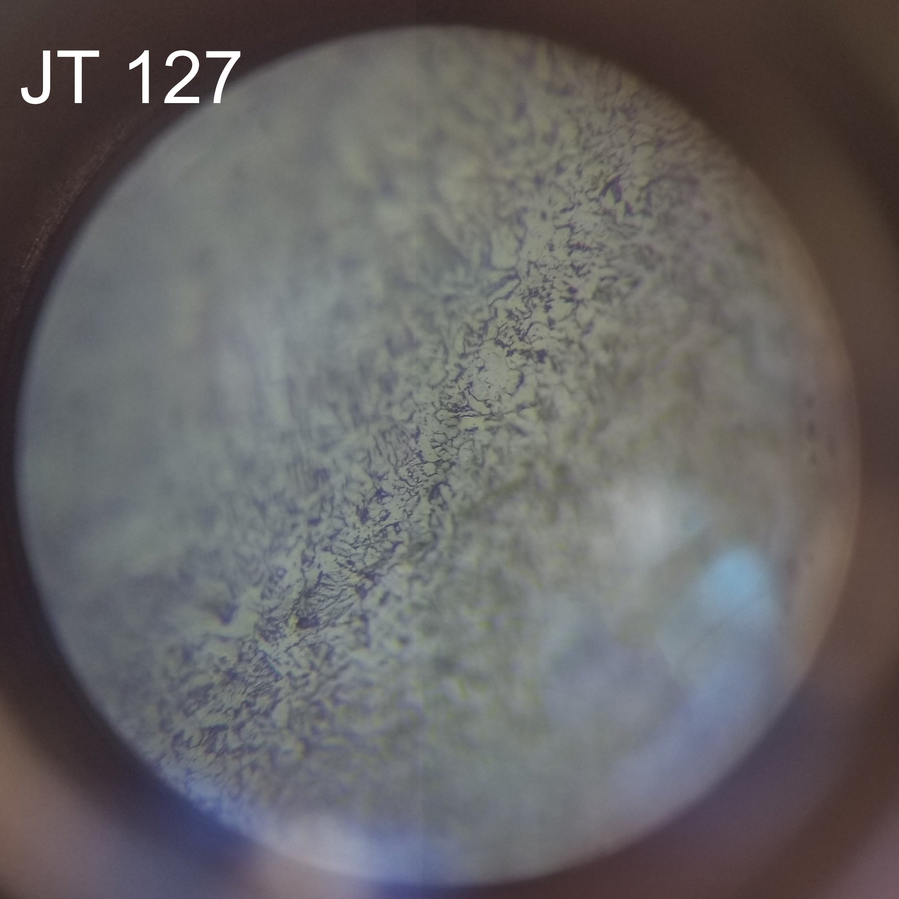{height=250px} 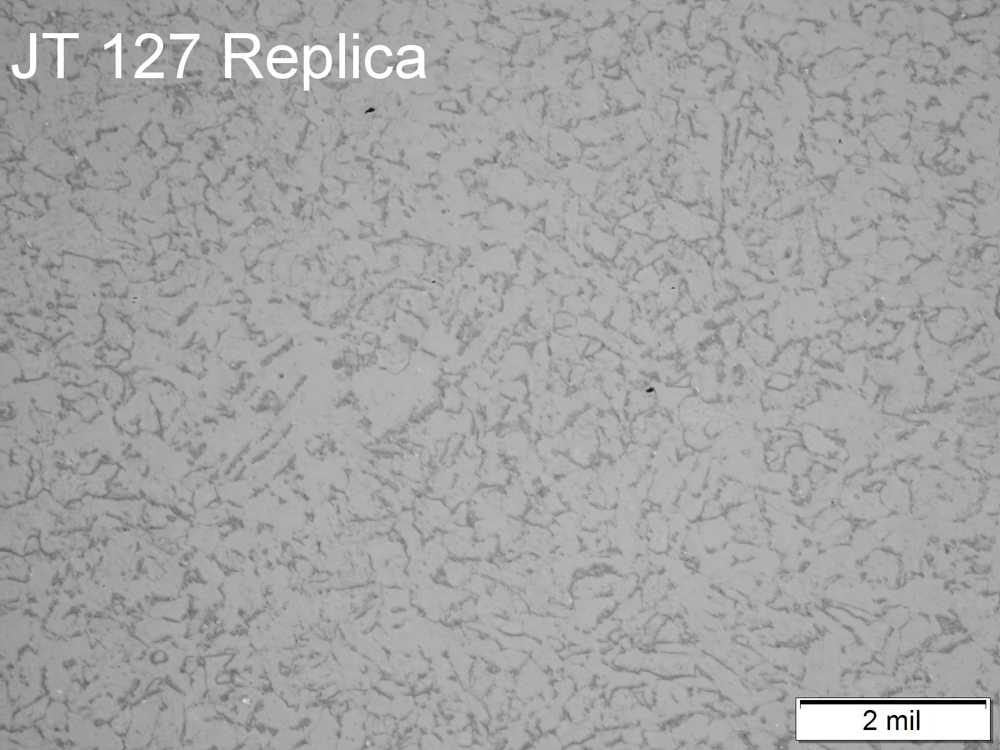{height=250px}
<br />
Feature JT-127 micrographs: in-situ (left) and replica (right). 
<br />
<br />
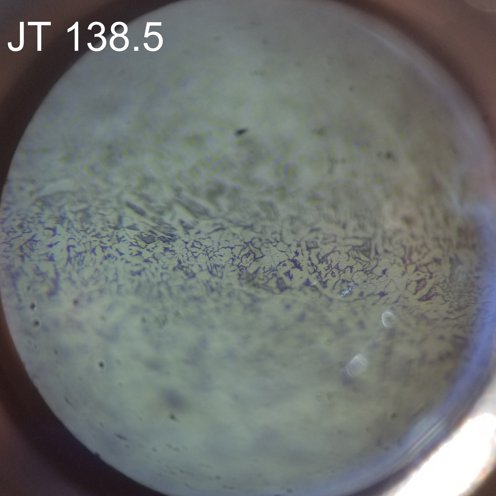{height=250px} 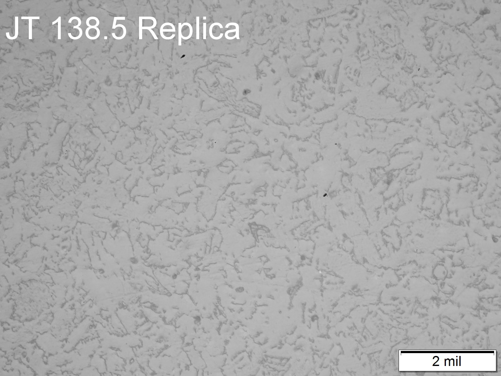{height=250px}<br />
Feature JT-138.5 micrographs: in-situ (left) and replica (right).
<br />
<br />
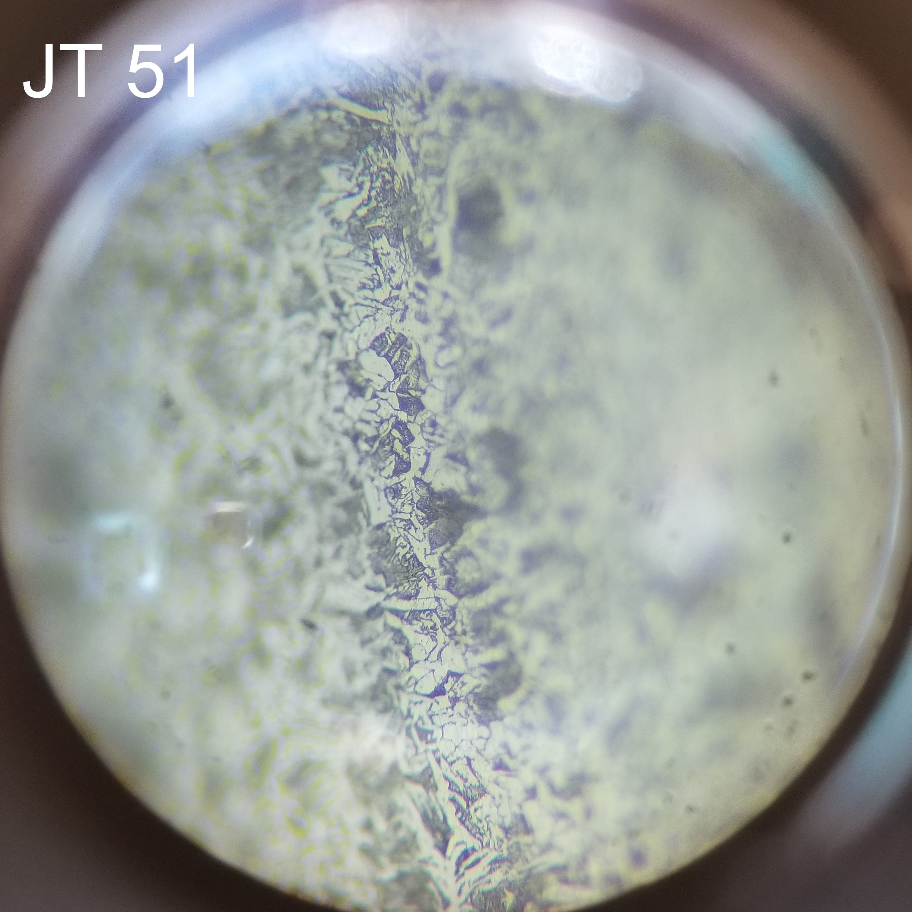{height=250px} 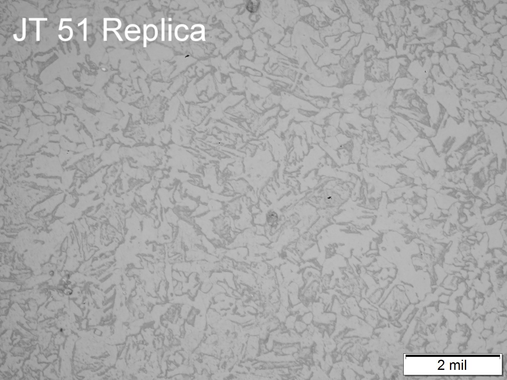{height=250px}
<br />
Feature JT-51 micrographs: in-situ (left) and replica (right).
<br />
<br />
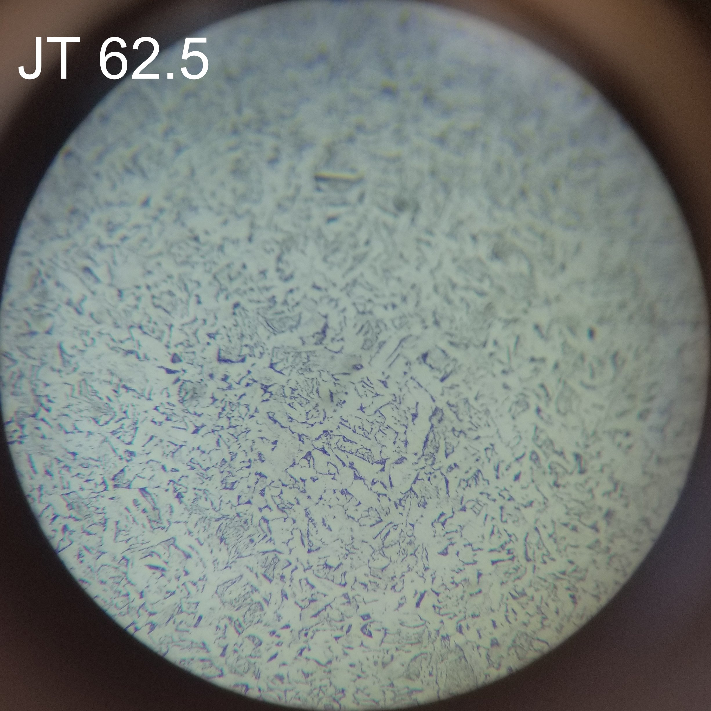{height=250px} 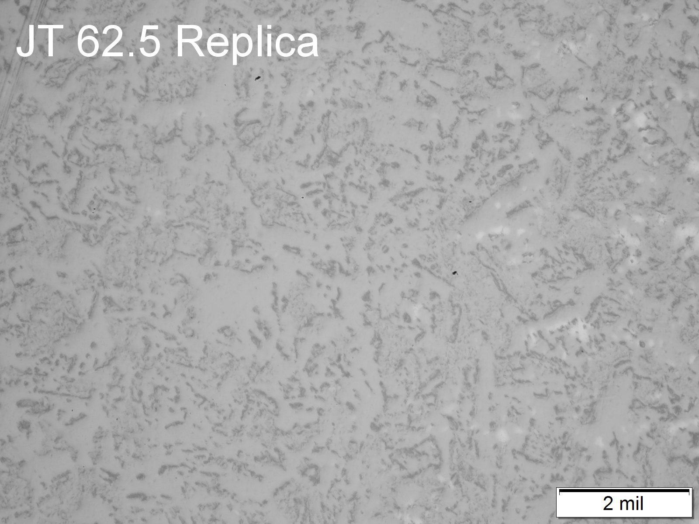{height=250px}
<br />
Feature JT-62.5 micrographs: in-situ (left) and replica (right).
<br />
<br />
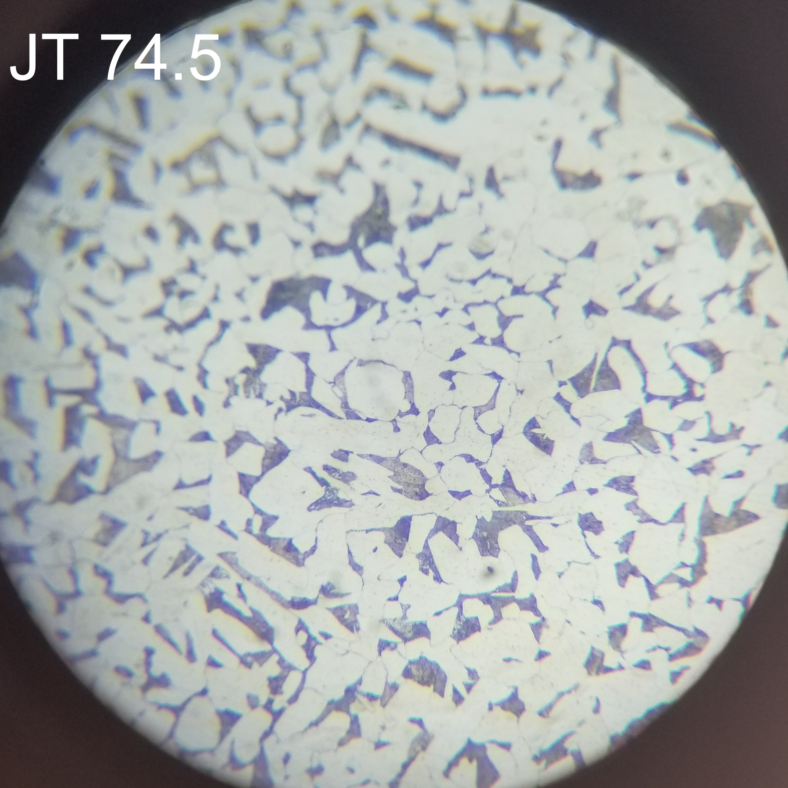{height=250px} 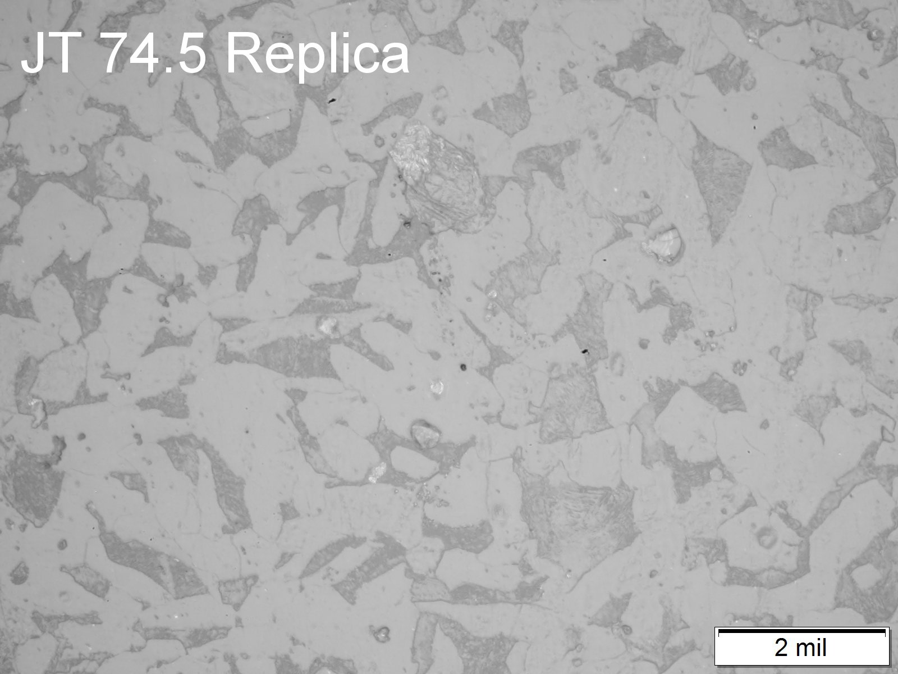{height=250px}
<br />
Feature JT-74.5 micrographs: in-situ (left) and replica (right).
<br />
<br />
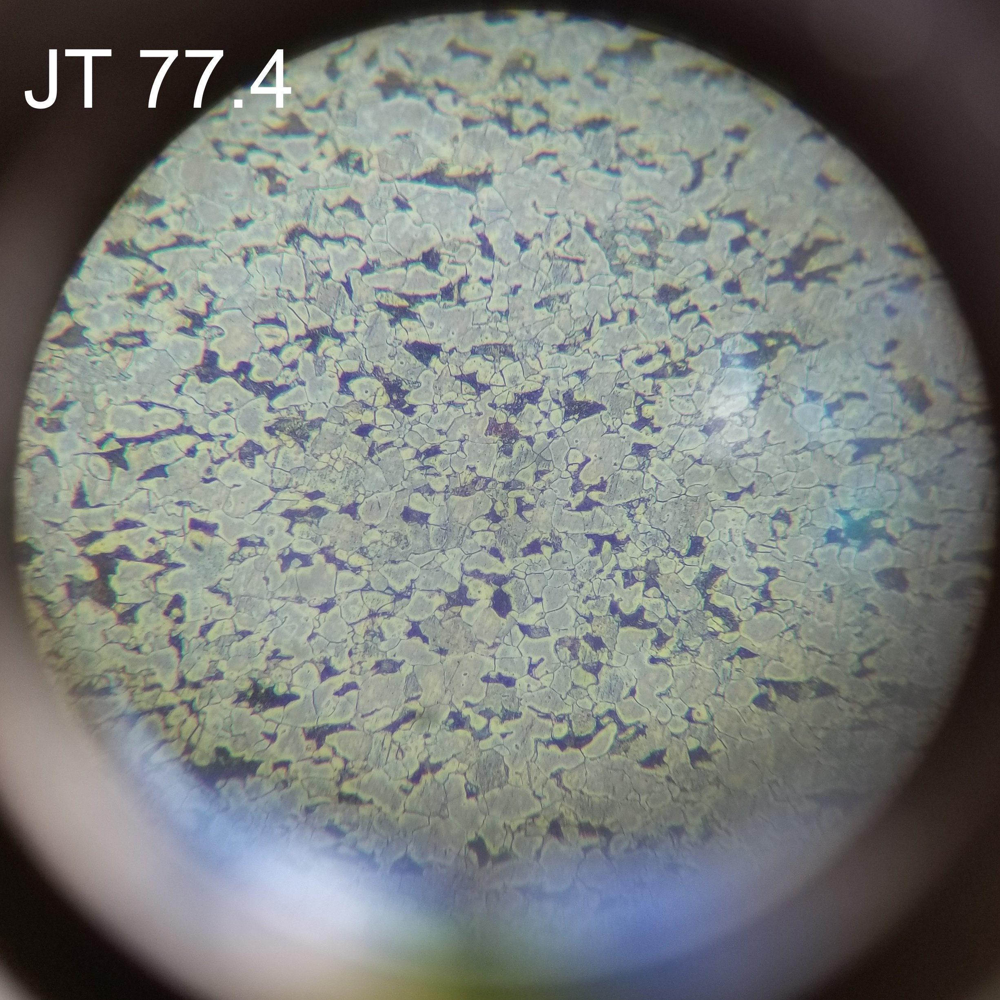{height=250px} 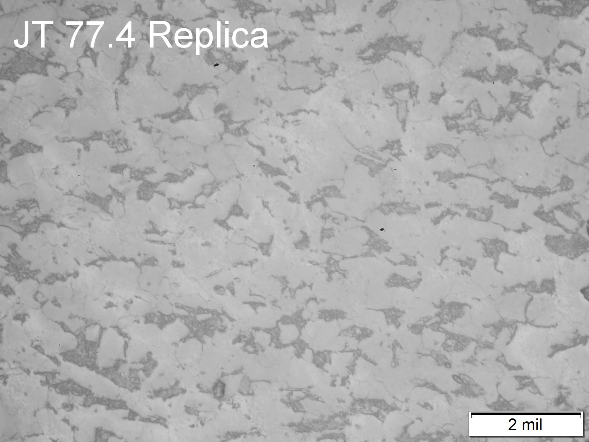{height=250px}
<br />
Feature JT-77.4 micrographs: in-situ (left) and replica (right).
<br />
<br />


# Quantitative Evaluations  

For the remainder of this analysis, features JT-51, JT-62.5, JT-127, and JT-138.5 were grouped together based on similarities in the microstructure as-well-as feature type, seam type, OD, WT, carbon, sulfur, manganese, and silicon content. The following table shows the results of the quantitative evaluations of grain size (ASTM) and dark phase for the samples. Per ASTM E112, the repeatability and reproducibility of comparison ratings for grain size are generally ±1 grain size number. The repeatability and reproducibility of the comparison ratings for dark phase are not yet known, but a reasonable estimate is ±20% of the value.

```{r station_micro data table}

station_micro_DT <- station_micro %>% 
  mutate(
    "dark phase (%)" = format(round(pct_dark_phase, 0), nsmall = 0),
    "grain size (ASTM)" = format(round(astm_grain_size, 1), nsmall = 1),
    "grain size (μm)" = format(round(mean_linear_intercept, 1), nsmall = 1)
  ) %>% 
  select(
    group,
    feature,
    "dark phase (%)",
    "grain size (ASTM)",
    "grain size (μm)"
  )

knitr::kable(station_micro_DT) %>% remove_column(1)


```


# Correlations  

Quantitative data from specific features have been compared to .... microstructural analysis team. The microstructural analysis team regularly performs two types of analysis for microstructures: grain size and percent dark phase (pearlite) estimation. These two types of analysis are important inputs to strength, grade, and vintage estimation procedures. Two methods are used for each analysis: counting and comparison methods. The counting and comparison methods for grain size are based on the ASTM E112 Jeffries planimetric method and comparison method, respectively. The counting method for dark phase is based on ASTM E562, and the comparison method for dark phase estimation was developed by PG&E.

## GS, DP, and Vintage  
```{r GS, DP, and Vintage, fig.height = 4, fig.width = 10}

plot1 <- ggplot() +
  geom_rect(
    data = station_micro,
    aes(
      xmin = gs_min,
      xmax = gs_max,
      ymin = c(1925, 1928, 1931),
      ymax = c(2024, 2018, 2021),
      fill = feature
    ),
    alpha = 0.2,
    show.legend = FALSE
  ) +
  geom_point(data = ndt_ten_comp_micro, aes(astm_grain_size, year)) +
  geom_vline(
    data = station_micro,
    aes(xintercept = astm_grain_size, col = feature),
    lty = 2,
    show.legend = FALSE
  ) +
  scale_y_continuous(breaks = seq(1940, 2020, by = 20)) +
  scale_x_continuous(breaks = seq(8, 14, by = 1))

plot2 <- ggplot() +
  geom_rect(
    data = station_micro,
    aes(
      xmin = dp_min,
      xmax = dp_max,
      ymin = c(1925, 1928, 1931),
      ymax = c(2024, 2018, 2021),
      fill = feature
    ),
    alpha = 0.2,
    show.legend = FALSE
  ) +
  geom_point(data = ndt_ten_comp_micro, aes(pct_dark_phase, year)) +
  geom_vline(
    data = station_micro,
    aes(xintercept = pct_dark_phase, col = feature),
    lty = 2
  ) +
  scale_y_continuous(breaks = seq(1940, 2020, by = 20))

plot1 + plot2

```

## GS, DP, and Charpy V Notch Upper Shelf Energy
```{r GS, DP, and Charpy, fig.height = 4, fig.width = 10}

plot1 <- ggplot() +
  geom_rect(
    data = station_micro,
    aes(
      xmin = gs_min,
      xmax = gs_max,
      ymin = c(8, 4, 12),
      ymax = c(300, 280, 320),
      fill = feature
    ),
    alpha = 0.2,
    show.legend = FALSE
  ) +
  geom_point(data = ndt_ten_comp_micro, aes(astm_grain_size, CVN_US_FS)) +
  geom_vline(
    data = station_micro,
    aes(xintercept = astm_grain_size, col = feature),
    lty = 2,
    show.legend = FALSE
  ) 

plot2 <- ggplot() +
  geom_rect(
    data = station_micro,
    aes(
      xmin = dp_min,
      xmax = dp_max,
      ymin = c(5, 10, 15),
      ymax = c(280, 300, 320),
      fill = feature
    ),
    alpha = 0.2,
    show.legend = FALSE
  ) +
  geom_point(data = ndt_ten_comp_micro, aes(pct_dark_phase, CVN_US_FS)) +
  geom_vline(
    data = station_micro,
    aes(xintercept = pct_dark_phase, col = feature),
    lty = 2
  ) 

plot1 + plot2

```


## GS, DP, and Charpy V Notch Transition Temperature
```{r GS, DP, and Charpy V Notch Transition Temperature, fig.height = 4, fig.width = 10}

plot1 <- ggplot() +
  geom_rect(
    data = station_micro,
    aes(
      xmin = gs_min,
      xmax = gs_max,
      ymin = c(-140, -130, -150),
      ymax = c(170, 180, 160),
      fill = feature
    ),
    alpha = 0.2,
    show.legend = FALSE
  ) +
  geom_point(data = ndt_ten_comp_micro, aes(astm_grain_size, TT_FS_F)) +
  geom_vline(
    data = station_micro,
    aes(xintercept = astm_grain_size, col = feature),
    lty = 2,
    show.legend = FALSE
  ) 

plot2 <- ggplot() +
  geom_rect(
    data = station_micro,
    aes(
      xmin = dp_min,
      xmax = dp_max,
      ymin = c(-140, -130, -140),
      ymax = c(170, 180, 170),
      fill = feature
    ),
    alpha = 0.2,
    show.legend = FALSE
  ) +
  geom_point(data = ndt_ten_comp_micro, aes(pct_dark_phase, TT_FS_F)) +
  geom_vline(
    data = station_micro,
    aes(xintercept = pct_dark_phase, col = feature),
    lty = 2
  ) 

plot1 + plot2
```

# Appendix 1: Quantitative Evaluation Methods 

## Grain Size (GS) by Mean Linear Intercept (MLI) 

Grain size was quantified using the ASTM E112 comparison method using a tool built into a Microsoft Excel document. In this method the sample grain structure was compared to a series of images of known grain size, and the image with grain size most closely matching the ferrite (light phase) grain size of the sample was selected. Per ASTM the repeatability and reproducibility of comparison chart ratings are generally ±1 grain size number. The comparison method is a rapid technique, requiring only about one minute per sample.

Selected images may also be quantified using the ASTM E112 Jeffries planimetric method, which is referred to herein as the "counting" method. In this method the number of grains in a known area are counted. The number of grains per unit area, NA , is used to determine the ASTM grain size number, G. Per ASTM, the precision of the method is about ±0.25 ASTM grain size units, and the repeatability and reproducibility are less than ±0.5 grain size units. The counting method is slower than the comparison method, requiring about 5-10 minutes depending on the microstructure and evaluator skill. Typically, for a 400X or 500X image, the counting method becomes quite difficult for grain sizes less than \~5 μm.

There are two dimensions used frequently for describing grain size, ASTM grain size (GS) and mean linear intercept (MLI) GS. The advantage of MLI GS is that it relates to a physical dimension in the microstructure (mean distance between grain intersections for random lines drawn on the 2-dimensional cross-section of the microstructure) and is reported herein in units of micrometers (μm). On the other hand, the ASTM GS sometimes enables better comparison of the standard deviation from large grain sizes to small grain sizes. Thus we will provide here the formulae to convert between MLI and ASTM GS as desired.

ASTM E112 defines grain size number, G as $N_{AE}=2^{G-1}$ where $N_{AE}$ is the number of grains per square inch at 100X magnification. To obtain the number per square millimeter at 1X, multiply by 15.50. For relating ASTM grain size number, G, to mean linear intercept, L, ASTM E112 defines G such that G=0 when L=320 μm. Thus, $G=10-2*LOG_2(L/10)$ and $L=320*2^{-G/2}$ for L in micrometers (μm).

## Dark Phase (DP)  

Dark phase was quantified using a comparison method developed by PG&E and Exponent. First, the amount of dark phase in several microstructures at several magnifications was quantified using image analysis and the ASTM E562 point counting method. Then, these images were incorporated into a tool built into a Microsoft Excel document for comparison with sample microstructures. The comparison microstructure with the amount of dark phase that most closely matches the sample is chosen at first. Then, interpolation is performed to increase the resolution for the amount of dark phase, depending on whether the sample appears to have more or less dark phase than the comparison micrograph.


```{r GS, DP, and Grade, fig.width=6.5, fig.height=9}

# Appendix 2: Other correlations 

## GS, DP, and Grade

# plot1 <- ndt_ten_comp_micro %>% 
#   filter(!is.na(grade)) %>% 
#   ggplot(aes(grade, astm_grain_size)) +
#   geom_boxplot(fill="steelblue")+
#   geom_hline(data = station_micro , aes(yintercept = astm_grain_size, col = feature), lty = 2)+
#   coord_flip()
# 
# plot2 <- ndt_ten_comp_micro %>% 
#   filter(!is.na(grade))%>% 
#   ggplot(aes(grade, mean_linear_intercept)) +
#   geom_boxplot(fill="steelblue")+
#     geom_hline(data = station_micro , aes(yintercept = mean_linear_intercept, col = feature), lty = 2)+
#   coord_flip()
# 
# plot3 <- ndt_ten_comp_micro %>% 
#     filter(!is.na(grade))%>% 
#   ggplot(aes(grade, pct_dark_phase)) +
#   geom_boxplot(fill="steelblue")+
#     geom_hline(data = station_micro , aes(yintercept = pct_dark_phase, col = feature), lty = 2)+
#   coord_flip()
# 
# plot1 + plot3


```

 
```{r GS, DP, and Yield Strength, fig.height = 10, fig.width = 6.5}

## GS, DP, and Yield Strength 

# plot1 <- ndt_ten_comp_micro %>%
#   ggplot(aes(astm_grain_size, ten_ys)) +
#   geom_point(color = "steelblue") +   
#   geom_vline(data = station_micro, aes(xintercept = astm_grain_size, col = feature),lty = 2) +
#   facet_grid( ~ sample_type)
# 
# plot2 <- ndt_ten_comp_micro %>%
#   ggplot(aes(mean_linear_intercept, ten_ys)) +
#   geom_point(color = "steelblue") + 
#   geom_vline(data = station_micro, aes(xintercept = mean_linear_intercept, col = feature), lty = 2) + 
#   facet_grid( ~ sample_type)
# 
# plot3 <- ndt_ten_comp_micro %>%
#   ggplot(aes(pct_dark_phase, ten_ys)) +
#   geom_point(color = "steelblue") +   
#   geom_vline(data = station_micro, aes(xintercept = pct_dark_phase, col = feature), lty = 2) +   
#   facet_grid( ~ sample_type)
# 
# plot1 + plot3

```

```{r GS, DP, and Ultimate Tensile Strength, fig.height = 10, fig.width = 6.5}

## GS, DP, and Ultimate Tensile Strength


# plot1 <- ndt_ten_comp_micro %>% 
#   ggplot(aes(astm_grain_size, ten_uts)) +
#   geom_point(color="steelblue")+   
#   facet_grid( ~ sample_type)
# 
# plot2 <- ndt_ten_comp_micro %>% 
#   ggplot(aes(mean_linear_intercept, ten_uts)) +
#   geom_point(color="steelblue")+   
#   facet_grid( ~ sample_type)
# 
# plot3 <- ndt_ten_comp_micro %>% 
#   ggplot(aes(pct_dark_phase, ten_uts)) +
#   geom_point(color="steelblue")+   
#   facet_grid( ~ sample_type)
# 
# plot1 + plot3
```

```{r GS, DP, and Strain Hardening Exponent, fig.height = 10, fig.width = 6.5}

## GS, DP, and Strain Hardening Exponent


# plot1 <- ndt_ten_comp_micro %>% 
#   ggplot(aes(astm_grain_size, ten_n)) +
#   geom_point(color="steelblue")+   
# facet_grid( ~ sample_type)
# 
# plot2 <- ndt_ten_comp_micro %>% 
#   ggplot(aes(mean_linear_intercept, ten_n)) +
#   geom_point(color="steelblue")+   
# facet_grid( ~ sample_type)
# 
# plot3 <- ndt_ten_comp_micro %>% 
#   ggplot(aes(pct_dark_phase, ten_n)) +
#   geom_point(color="steelblue")+   
# facet_grid( ~ sample_type)
# 
# plot1 + plot3
```