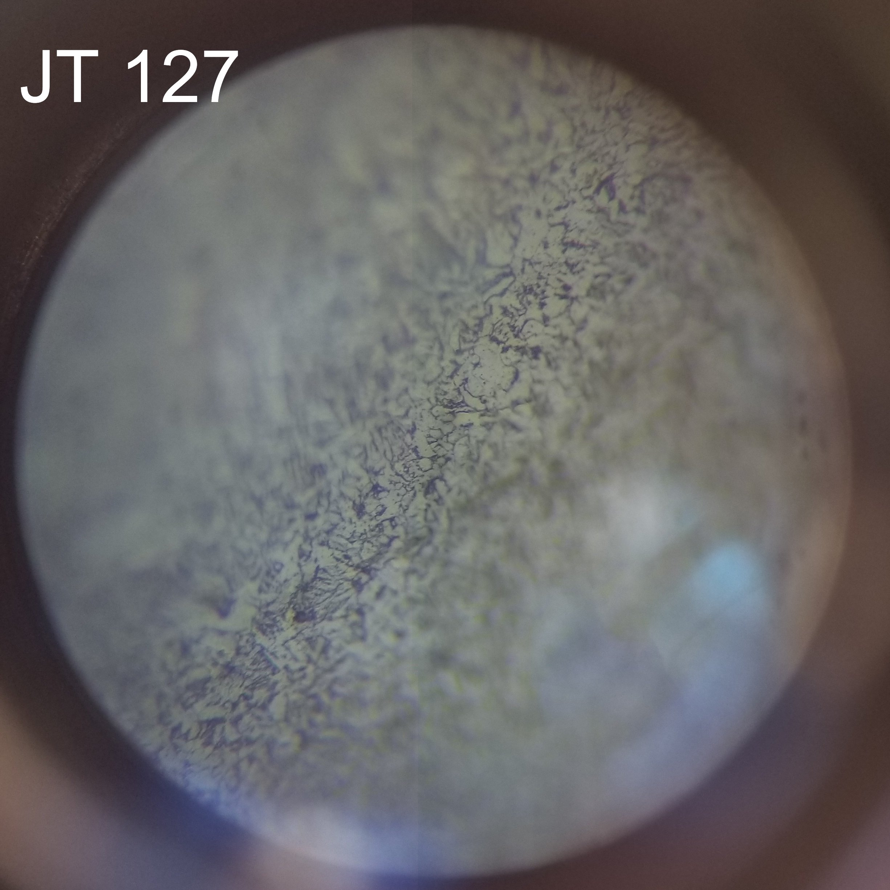
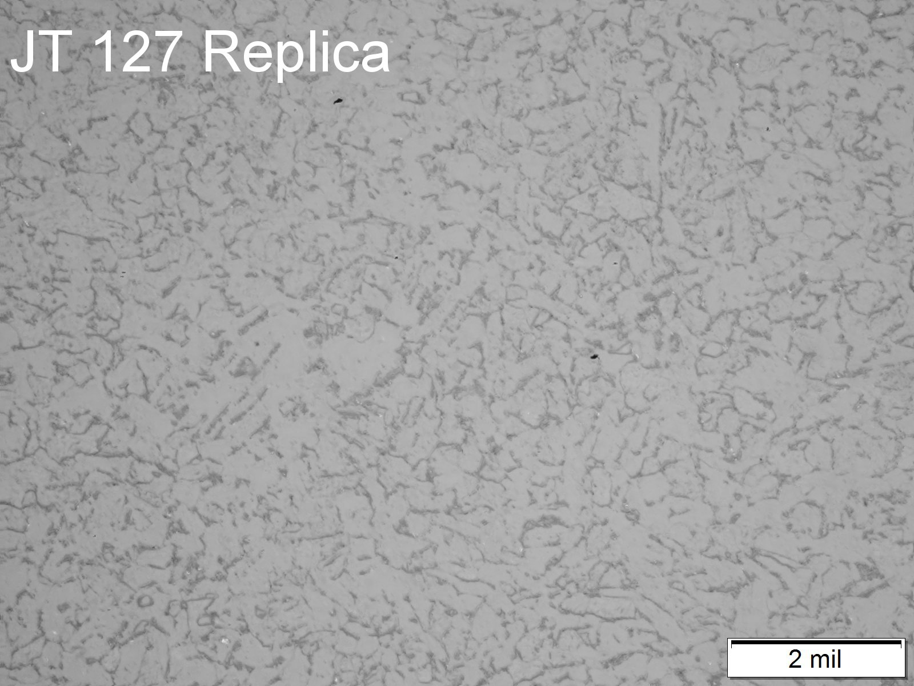
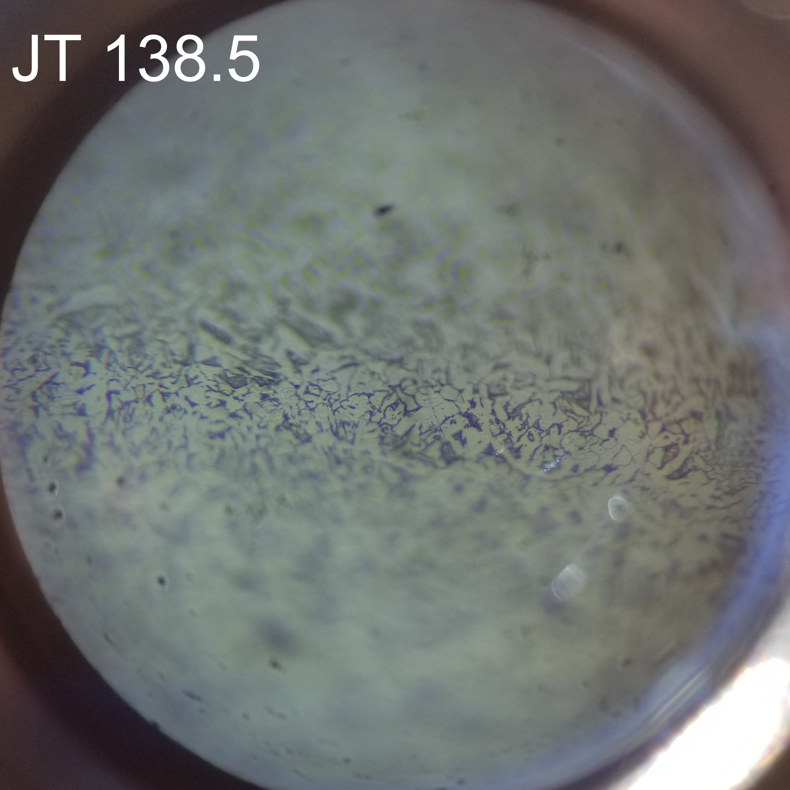
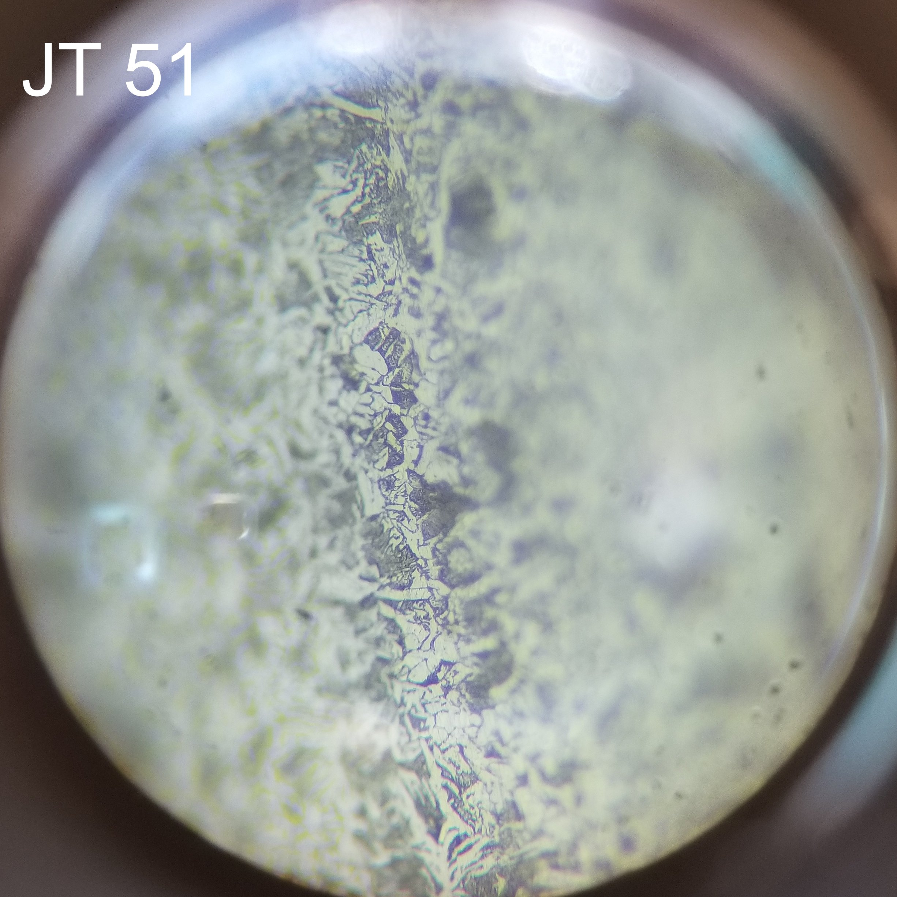
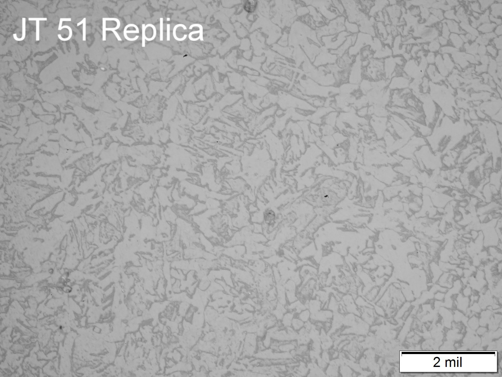
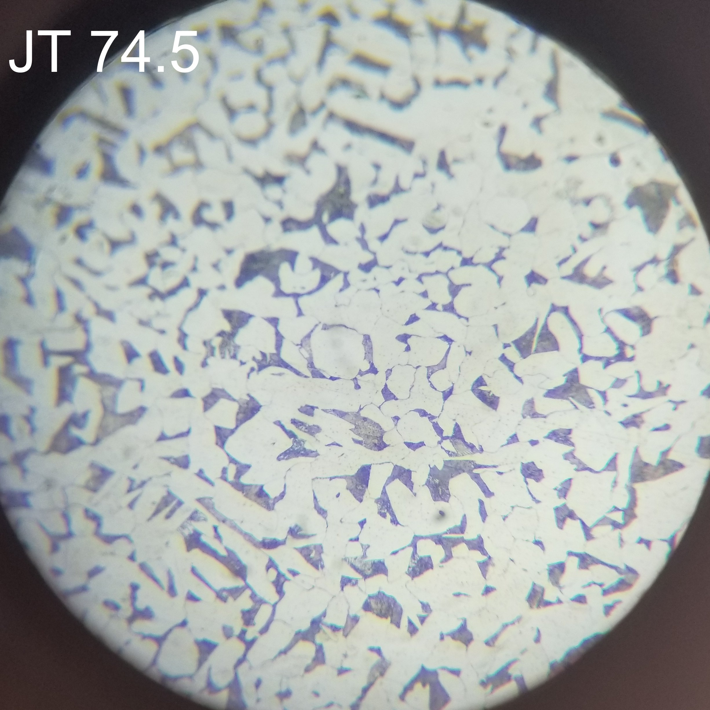
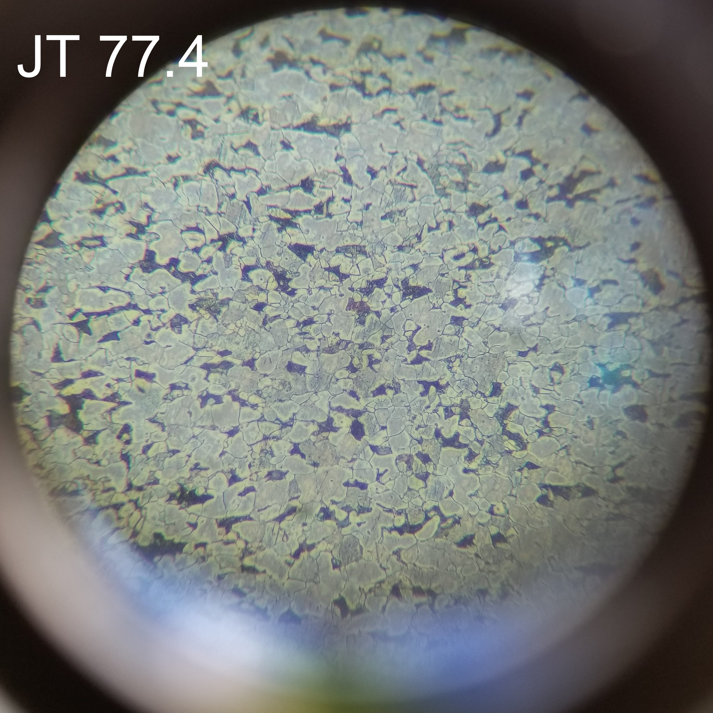
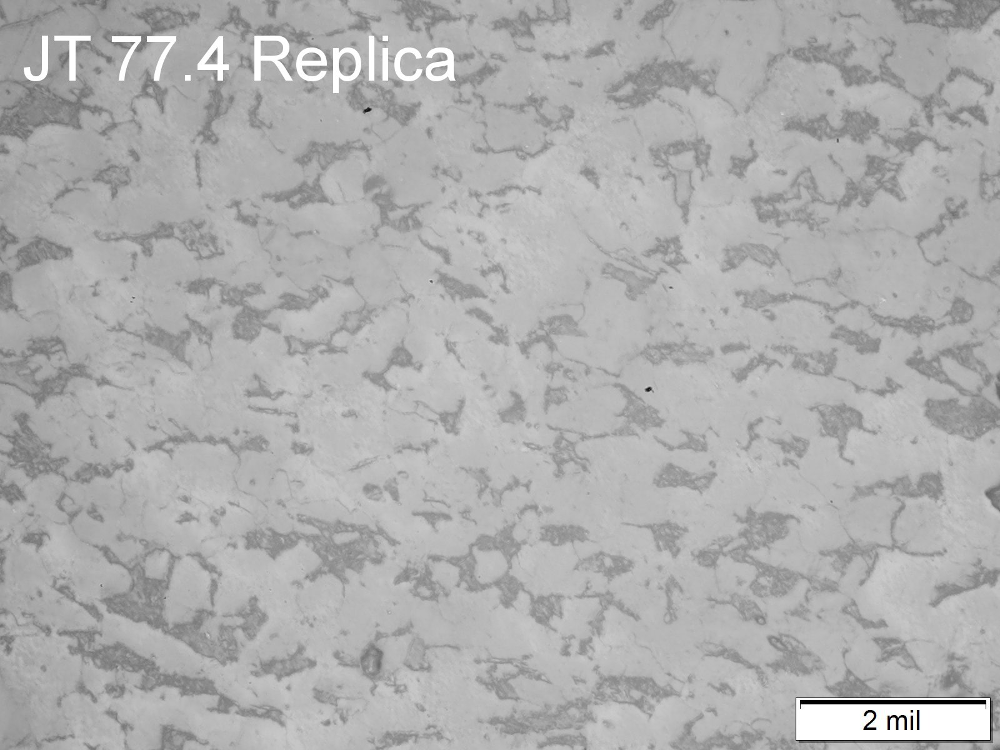

```{r setup, include=FALSE}
knitr::opts_chunk$set(echo = FALSE, warning=FALSE, message=FALSE)
```

# Images 

The microstructures that were analyzed are shown below. For the in-situ images, the circular viewing area was determined to be 465 μm in diameter. This scale is based on images taken by the vendor of a calibrated reference slide and is important for grain size estimation.

{height=300px} {height=300px}
<br />
Feature JT-127 micrographs: in-situ (left) and replica (right). 
<br />
<br />
{height=300px} {height=300px}<br />
Feature JT-138.5 micrographs: in-situ (left) and replica (right).
<br />
<br />
{height=300px} {height=300px}
<br />
Feature JT-51 micrographs: in-situ (left) and replica (right).
<br />
<br />
{height=300px} {height=300px}
<br />
Feature JT-62.5 micrographs: in-situ (left) and replica (right).
<br />
<br />
{height=300px} {height=300px}
<br />
Feature JT-74.5 micrographs: in-situ (left) and replica (right).
<br />
<br />
{height=300px} {height=300px}
<br />
Feature JT-77.4 micrographs: in-situ (left) and replica (right).
<br />
<br />